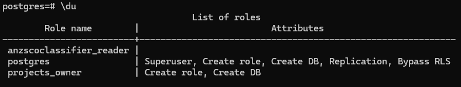

# ANZSCO-Classifier
ANZSCO-Classifier is a tool designed to streamline the process of assigning the correct Australian and New Zealand Standard Classification of Occupations (ANZSCO) code to resumes based on the tasks and responsibilities listed.

## Introduction
Format
- Introduce what ANZSCO is for
- Introduce the template and website: https://www.abs.gov.au/ausstats/abs@.nsf/Product+Lookup/9F38DBF4AE58BAD9CA257B9500131004?opendocument&fbclid=IwZXh0bgNhZW0CMTEAAR1xRmkpHPNgR0DjqyDqndzsUvvL2Ltsgca9ElhqZIbbHXtd_5xVKuDM5cc_aem_lyUnchjNgtZ7ABe-OoHb4g
- I'm a data engineer and currently there is no specific anzsco code for that. We are basing on tasks that is most closely related to an anzsco code, in this case I opt to choosing analyst programmer. I created this mini project to make things easier for those who wanted to know what anzsco code to choose if they can't find their specific profession.

## Requirements
- PostgreSQL installed locally. Please check this link for installation instructions: https://www.w3schools.com/postgresql/postgresql_install.php

    - Create new database, schema, table, users for projects. Separate users for read and write access created for security reasons. I also listed below the users, dbs, schema, and grants executed. This can be optimized by using dbt but this implementation is for next project.

        - User creation: https://www.postgresql.org/docs/8.0/sql-createuser.html
            - projects_owner (owner of db) 
            <code>
             CREATE USER projects_owner WITH PASSWORD '******' CREATEROLE CREATEDB;
            </code>
            - anzscoclassifier_reader (only read access to schema anzsco)
            <code>
             CREATE USER anzscoclassifier_reader WITH PASSWORD 'reader_access';
            </code>
            #### Expected output of users created
            

        - Database creation: https://www.postgresql.org/docs/current/sql-createdatabase.html
            - projects (this db will possibily contain future projects as well)
            <code>
             CREATE DATABASE projects OWNER projects_owner;
            </code>
            #### Expected output of db created
            

        - Schema creation: https://www.postgresql.org/docs/current/sql-createschema.html
            - anzscoclassifier
            <code>
             CREATE SCHEMA IF NOT EXISTS anzscoclassifier AUTHORIZATION projects_owner;
            </code>
            #### Expected output of schema created
            

        - Table creation: https://www.postgresql.org/docs/current/sql-createtable.html
            - anzscocodes

        - Grant access: https://www.postgresql.org/docs/current/sql-grant.html
            - grant select, connect on anzscocodes to user anzscocodes_reader
            <code>
            GRANT SELECT, CONNECT, USAGE ON anzscocodes TO anzscoclassifier_reader;
            </code>

    - Setup psycopg2 to connect python code to PostgreSQL DB: https://www.datacamp.com/tutorial/tutorial-postgresql-python
